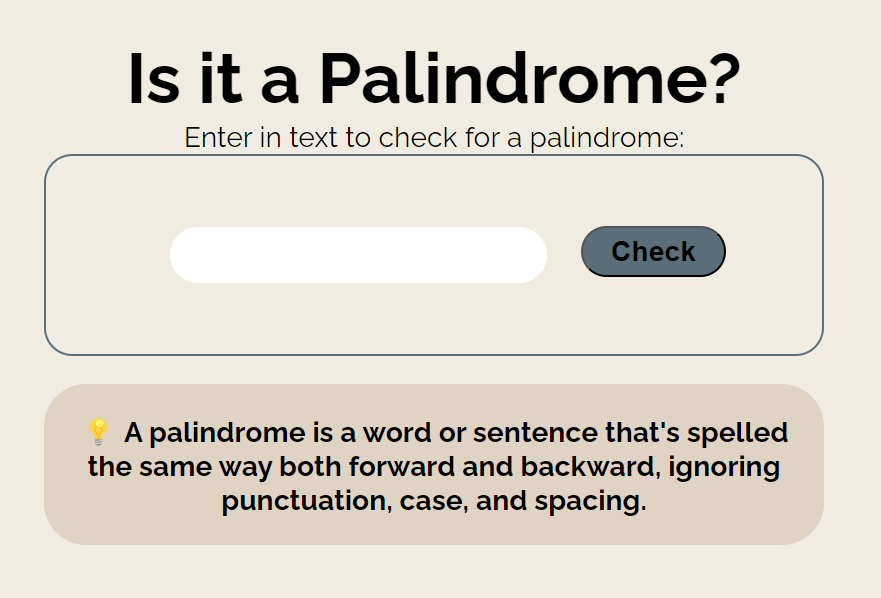

# Palindrome Checker JS

This repository contains a simple but effective Palindrome Checker application built with vanilla JavaScript. It allows users to input text and check if it's a palindrome, meaning the text reads the same forward and backward, ignoring punctuation, case, and spacing.



## Features

- **Clean and Simple UI:** Easy to use web interface.
- **Live Feedback:** Utilizes LiveServer for instant visual feedback during development.
- **Input Sanitization:** Removes non-alphanumeric characters and converts to lowercase to ensure accurate palindrome checking.

## How to Use

1. Clone the repository to your local machine.
2. Open the project in your favorite IDE.
3. Run the project using LiveServer to see it in action.
4. Enter any text in the input box and press the 'Check' button to see if it's a palindrome.

## Local Development

This project uses LiveServer for local development to serve the files and automatically reload the page on changes. If you have LiveServer installed, you can start the server by opening the project directory in your terminal and running:

```bash
live-server
```

If you don't have LiveServer installed, you can install it globally via npm:

```
npm install -g live-server
```
